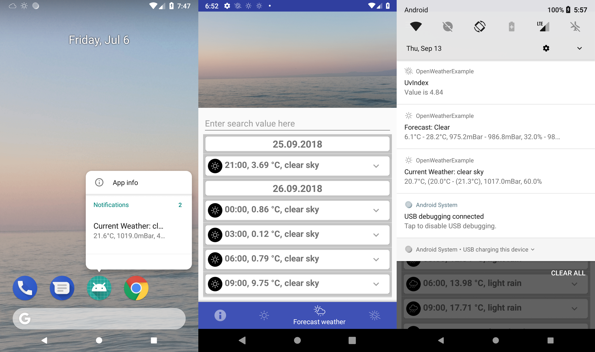

# OpenWeather-Android

[](https://www.android.com)
[](https://opensource.org/licenses/MIT)
[](http://makeapullrequest.com)
[](https://www.paypal.me/GuepardoApps)

[](https://jitpack.io/#OpenWeatherLib/OpenWeather-Android)
[](https://github.com/OpenWeatherLib/OpenWeather-Android/releases/tag/1.9.3)
[](lib)
[](https://android-arsenal.com/api?level=24)

## About

library for downloading and handling data from openweather

example application can be found here: [app](app) (Fork project and add your private OpenWeather ApiKey to settings.xml)

Based on Kotlin, using Listener, Extensions and more.

---



---


---

## Api Keys

Required api keys are 

- [x] https://unsplash.com/
- [x] https://openweathermap.org/

## Integration

First you have to register an account at [OpenWeatherMap.org](http://www.openweathermap.org/) and receive an API key.
This key is an important parameter of the OpenWeatherService and needs to be set in the settings.xml along with the key for unsplash api (new, not needed but fancy for city image)!

The easiest way to integrate the library is to use the OpenWeatherService and to subscribe on weatherCurrentPublishSubject and weatherForecastPublishSubject using ReactiveX2.
You can also use the build in views for the city, current and forecast weather and  the uv index.

```java
class MainActivity : AppCompatActivity() {

    private var subscriptions: Array<Disposable?> = arrayOf()

    override fun onCreate(savedInstanceState: Bundle?) {
        super.onCreate(savedInstanceState);
        ...

        OpenWeatherService.instance.initialize(this, getString(R.string.openweather_city)) // Initialize service already with your preferred city
        OpenWeatherService.instance.apiKey = getString(R.string.openweather_api_key)    // Set ApiKey => Will be read from xml file

        ImageService.instance.initialize(this) 											// Initialize service
        ImageService.instance.accessKey = getString(R.string.image_api_access_key)    	// Set AccessKey => Will be read from xml file

        OpenWeatherService.instance.notificationEnabled = true                          // Enable/Disable notifications
        OpenWeatherService.instance.wallpaperEnabled = true                             // Enable/Disable set of wallpaper
        OpenWeatherService.instance.receiverActivity = MainActivity::class.java         // Set receiver for notifications
		
        // Subscribe on weatherCurrentPublishSubject (Using ReactiveX2)
		subscriptions = subscriptions.plus(
			OpenWeatherService.instance.weatherCurrentPublishSubject
				.subscribeOn(Schedulers.io())
				.subscribe(
					{
						response -> TODO("not implemented") //To change body of created functions use File | Settings | File Templates.
					},
					{
						responseError -> TODO("not implemented") //To change body of created functions use File | Settings | File Templates.
					}
				))

        // Subscribe on weatherForecastPublishSubject (Using ReactiveX2)
		subscriptions = subscriptions.plus(
			OpenWeatherService.instance.weatherForecastPublishSubject
				.subscribeOn(Schedulers.io())
				.subscribe(
					{
						response -> TODO("not implemented") //To change body of created functions use File | Settings | File Templates.
					},
					{
						responseError -> TODO("not implemented") //To change body of created functions use File | Settings | File Templates.
					}
				))

        // Subscribe on uvIndexPublishSubject (Using ReactiveX2)
		subscriptions = subscriptions.plus(
			OpenWeatherService.instance.uvIndexPublishSubject
				.subscribeOn(Schedulers.io())
				.subscribe(
					{
						response -> TODO("not implemented") //To change body of created functions use File | Settings | File Templates.
					},
					{
						responseError -> TODO("not implemented") //To change body of created functions use File | Settings | File Templates.
					}
				))

        // Finally start everything (IMPORTANT)
        OpenWeatherService.instance.start()

        ...
    }

    override fun onDestroy() {
        super.onDestroy()
        subscriptions.forEach { x -> x?.dispose() }
        subscriptions = arrayOf()
        OpenWeatherService.instance.dispose() // Dispose the service
    }
}
```

To display received data use the custom adapter in the library

```java
class MainActivity : AppCompatActivity() {

    private var subscriptions: Array<Disposable?> = arrayOf()

    ...
    // Subscribe on weatherForecastPublishSubject (Using ReactiveX2)
	subscriptions = subscriptions.plus(
		OpenWeatherService.instance.weatherForecastPublishSubject
			.subscribeOn(Schedulers.io())
			.subscribe(
				{
					response -> 
						if (response.value != null) {
							val data = response.value as WeatherForecast
							val list = data.list
							if (list.isNotEmpty()) {
								val adapter = ForecastListAdapter(this, list)
								listView.adapter = adapter
								mainImageView.setImageResource(forecastWeather.getMostWeatherCondition().wallpaperId)
							} else {
								Logger.instance.warning(tag, "list is empty")
							}
						} else {
							Logger.instance.warning(tag, "weather forecast subscribe was  not successfully")
						}
				},
				{
					responseError -> // TODO("not implemented") //To change body of created functions use File | Settings | File Templates.
				}
			))
    ...
}
```

## Installation

Add the JitPack repository to your `build.gradle`:

```groovy
allprojects {
 repositories {
    maven { url "https://jitpack.io" }
    }
}
```

Add the dependency to your `build.gradle`:

```groovy
dependencies {
    implementation 'com.github.OpenWeatherLib.OpenWeatherLib-Android:lib:1.9.3'
}
```

## Requirements

- Use at least JVM 1.8

## Contributors

| [](https://github.com/GuepardoApps) |
| :---------------------------------------------------------------------------------------------------------------------------------------: |
| [GuepardoApps](https://github.com/GuepardoApps) |

## License

OpenWeather-Android is distributed under the MIT license. [See LICENSE](LICENSE.md) for details.

```
MIT License

Copyright (c) 2018 - 2019 GuepardoApps (Jonas Schubert)

Permission is hereby granted, free of charge, to any person obtaining a copy
of this software and associated documentation files (the "Software"), to deal
in the Software without restriction, including without limitation the rights
to use, copy, modify, merge, publish, distribute, sublicense, and/or sell
copies of the Software, and to permit persons to whom the Software is
furnished to do so, subject to the following conditions:

The above copyright notice and this permission notice shall be included in all
copies or substantial portions of the Software.

THE SOFTWARE IS PROVIDED "AS IS", WITHOUT WARRANTY OF ANY KIND, EXPRESS OR
IMPLIED, INCLUDING BUT NOT LIMITED TO THE WARRANTIES OF MERCHANTABILITY,
FITNESS FOR A PARTICULAR PURPOSE AND NONINFRINGEMENT. IN NO EVENT SHALL THE
AUTHORS OR COPYRIGHT HOLDERS BE LIABLE FOR ANY CLAIM, DAMAGES OR OTHER
LIABILITY, WHETHER IN AN ACTION OF CONTRACT, TORT OR OTHERWISE, ARISING FROM,
OUT OF OR IN CONNECTION WITH THE SOFTWARE OR THE USE OR OTHER DEALINGS IN THE
SOFTWARE.
```
